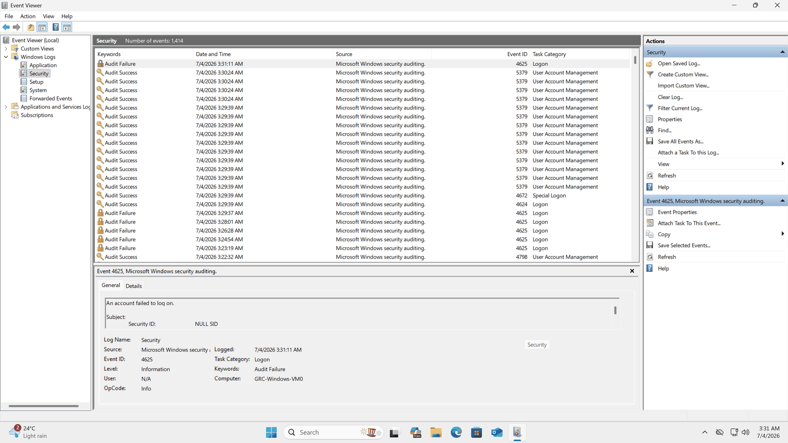

# Cloud Security Risk Assessment — Azure GRC Simulation

A governance, risk and compliance (GRC) assessment of a single internet-exposed Azure virtual machine, carried out end to end: build the environment, gather evidence from the platform and the guest OS, quantify the risks, and map each recommended control to NIST CSF and CIS Controls v8.

The assessment is **non-exploitative**. Nothing was attacked or exploited — findings come from configuration review and native logging, which is how a real GRC or audit function works.

---

## Headline finding

The lab was deployed with RDP (TCP/3389) open to `Source: Any`, exactly as the exercise intended. Within hours of deployment the VM's own Security log had recorded **repeated Event ID 4625 failed-logon attempts with a NULL SID, arriving at roughly 95-second intervals** — a cadence too regular to be human.

That turns the central risk of this assessment from a textbook example into a measured observation. The exposure was not hypothetical; it was already being probed, on a machine that had existed for a few hours and that nobody knew about.

<p align="center">
  
</p>

> **Caveat, stated honestly:** the source IP address of these attempts was not captured during the assessment. Event 4625's `Network Information → Source Network Address` field would confirm whether the attempts originated externally. Until that is collected, "consistent with automated authentication attempts" is the strongest supportable claim — not "confirmed brute-force attack." Capturing it is listed under [Known limitations](#known-limitations).

---

## Environment assessed

| Item | Value |
|---|---|
| Cloud provider | Microsoft Azure |
| Subscription | Azure for Students Starter *(ID redacted)* |
| Resource group | `GRC-Lab` |
| Region | Central India (Zone 1) |
| Virtual machine | `GRC-Windows-VM01` |
| Operating system | Windows 11 Pro, version 25H2, x64 Gen 2 (image `win11-25h2-pro`) |
| Size | Standard B2als_v2 — 2 vCPU, 4 GiB RAM |
| OS disk | Standard SSD, managed |
| Networking | `GRC-Windows-VM01-vnet` / `default`, private IP `10.1.0.4`, public IPv4 enabled *(redacted)* |
| Network security group | `GRC-Windows-VM01-nsg`, attached to the NIC only |
| Access method | Remote Desktop Protocol (RDP), TCP/3389 |
| Administrative account | `azureadmin` (local, sole member of Administrators) |

**In scope:** the VM, its NIC and NSG, its public IP, the local identity store, and the subscription/resource-group control plane surrounding it.
**Out of scope:** all other Azure services, applications, data classification, and any form of exploitation or penetration testing.

---

## Risk scoring model

`Risk Score = Likelihood × Impact`, each scored 1–5.

| Likelihood | | Impact | |
|---|---|---|---|
| 1 | Rare | 1 | Minimal |
| 2 | Unlikely | 2 | Minor |
| 3 | Possible | 3 | Moderate |
| 4 | Likely | 4 | High |
| 5 | Almost certain | 5 | Critical |

| Score | 1–5 | 6–10 | 11–15 | 16–25 |
|---|---|---|---|---|
| **Rating** | Low | Medium | High | Critical |

---

## Risk register

| ID | Asset | Threat | L | I | Score | Rating |
|---|---|---|:-:|:-:|:-:|---|
| R-01 | RDP endpoint (TCP/3389) | Automated brute-force / password spray | 5 | 4 | **20** | 🔴 Critical |
| R-02 | `azureadmin` local administrator | Credential compromise → full system control | 4 | 5 | **20** | 🔴 Critical |
| R-03 | Windows 11 Pro guest OS | Exploitation of unpatched vulnerabilities | 3 | 4 | **12** | 🟠 High |
| R-04 | Security event log | Undetected intrusion, loss of evidence | 4 | 3 | **12** | 🟠 High |
| R-05 | Subscription / resource group | Privilege misuse on the management plane | 2 | 5 | **10** | 🟡 Medium |
| R-06 | VNet segmentation | Lateral movement after compromise | 2 | 4 | **8** | 🟡 Medium |
| R-07 | Outbound network path | C2 beaconing / data exfiltration | 2 | 4 | **8** | 🟡 Medium |
| R-08 | VM availability | Destructive event with no recovery point | 2 | 4 | **8** | 🟡 Medium |
| R-09 | OS disk & boot integrity | Offline disk access / boot tampering | 1 | 3 | **3** | 🟢 Low |

**Profile:** 2 Critical · 2 High · 4 Medium · 1 Low → **overall risk posture: High**

Full justifications and evidence references: [`artifacts/risk-register.csv`](artifacts/risk-register.csv)

Note that R-09 is scored Low and explicitly accepted. A register in which every finding is Critical is a register nobody acts on; the discipline is in scoring proportionately and defending each number.

---

## Control mapping

| Risk | Control | Type | NIST CSF 1.1 | CIS v8 |
|---|---|---|---|---|
| R-01 | Restrict NSG source to a trusted CIDR; move to Azure Bastion or Just-in-Time access | Preventive | PR.AC-3, PR.PT-4 | 4.6, 12.7 |
| R-02 | MFA for administrative access; named admin account; lockout policy | Preventive | PR.AC-1, PR.AC-7 | 5.4, 6.5 |
| R-03 | Azure Update Manager schedule; security baseline via Azure Policy | Corrective | PR.IP-1, PR.IP-12 | 4.1, 7.3 |
| R-04 | Log Analytics workspace; Defender for Servers; alert rule on 4625 volume | Detective | DE.CM-1, DE.AE-3 | 8.9, 13.1 |
| R-05 | Least-privilege RBAC; Entra PIM; resource locks | Preventive | PR.AC-4, ID.GV-2 | 5.1, 6.8 |
| R-06 | Subnet-level NSG plus Application Security Groups | Preventive | PR.AC-5 | 12.2, 4.4 |
| R-07 | Egress filtering via Azure Firewall; NSG flow logs | Preventive / Detective | PR.PT-4 | 13.6, 12.2 |
| R-08 | Azure Backup with Recovery Services vault; soft delete; delete lock | Corrective | PR.IP-4, RC.RP-1 | 11.2, 11.3 |
| R-09 | Encryption at host; Trusted Launch integrity monitoring | Preventive / Detective | PR.DS-1 | 3.11, 4.1 |

Full table with priorities: [`artifacts/control-mapping.csv`](artifacts/control-mapping.csv)

Framework identifiers follow **NIST CSF 1.1**, matching the assessment brief. Under CSF 2.0 the `PR.AC` category has been reorganised into `PR.AA` (Identity Management, Authentication and Access Control) and much of `PR.IP` into `PR.PS` (Platform Security).

---

## Prioritised remediation

**P1 — immediate**

1. Change the NSG `RDP` rule source from `Any` to a specific trusted IP or CIDR. One field, and it removes the exposure driving both Critical risks.
2. Stand up Azure Bastion or enable Just-in-Time VM access so TCP/3389 is not permanently open at all.
3. Require MFA for administrative access, and create a named admin account rather than relying on the default `azureadmin`.
4. Route Security event logs to a Log Analytics workspace and alert on 4625 volume thresholds.

**P2 — within 30 days**

5. Enrol the VM in Azure Update Manager and apply a security baseline through Azure Policy guest configuration.
6. Replace standing privileged access with Entra PIM just-in-time elevation; add a delete lock on `GRC-Lab`.
7. Configure Azure Backup with a daily policy and vault soft delete.

**P3 — within 90 days**

8. Attach an NSG at subnet level in addition to the NIC.
9. Constrain egress and enable NSG flow logs.

---

## Repository contents

```
├── README.md                              this page
├── docs/
│   ├── Risk-Assessment-Report.pdf         the formal GRC deliverable
│   ├── Risk-Assessment-Report.docx        editable source
│   └── lab-walkthrough.md                 build + evidence collection, with screenshots
├── artifacts/
│   ├── asset-inventory.csv                assets with CIA ratings
│   ├── threat-vulnerability-summary.csv   threat ↔ vulnerability pairing
│   ├── risk-register.csv                  scored register with justifications
│   └── control-mapping.csv                controls mapped to NIST CSF and CIS v8
└── screenshots/                           48 redacted evidence captures
```

---

## Known limitations

Stating these is part of the deliverable, not an apology for it.

- **Source IPs of the 4625 events were not captured.** Without them, the failed logons are consistent with automated attempts but not confirmed as external. This is the single most valuable addition to make on a repeat run.
- **A point-in-time review.** Configuration was assessed over one session; no drift monitoring or continuous compliance scanning was in place.
- **No exploitation was performed,** by design. Vulnerability presence is inferred from configuration and vendor documentation, not from proof of exploitability.
- **Single-workload scope.** Segmentation and lateral-movement risks (R-06) are scored against a hypothetical future estate rather than an observed one.
- **No data classification.** Impact scores assume the host holds no regulated data. Any real workload would need scores revisited against actual data sensitivity.

---

## Sanitisation note

All screenshots have been redacted to remove the subscription ID, public IP addresses, tenant and account identifiers, resource URLs and correlation IDs. No credentials, `.rdp` files or key material are included in this repository. The `.gitignore` blocks the file types most likely to leak them.

---

## What this project demonstrates

Deploying and documenting a cloud environment; gathering evidence from both the Azure control plane and the guest OS; converting technical observations into scored, defensible business risk; mapping controls to recognised frameworks so decisions survive an audit; and writing findings for an audience that includes people who will never open the Azure portal.

*Built as a self-directed GRC exercise. The environment has since been decommissioned.*
